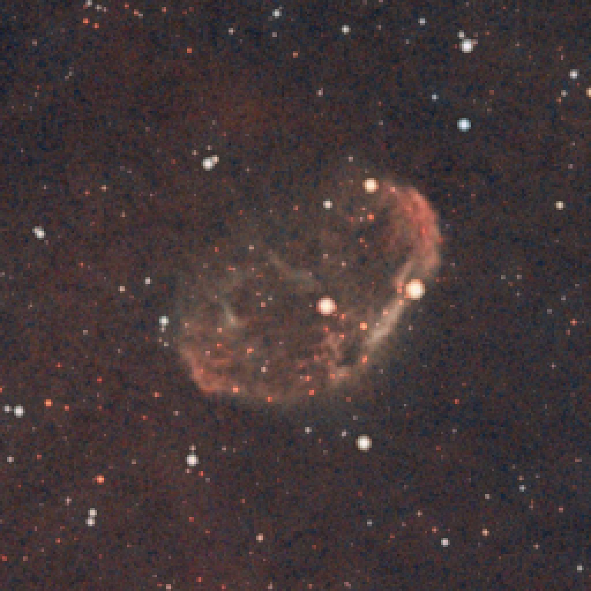
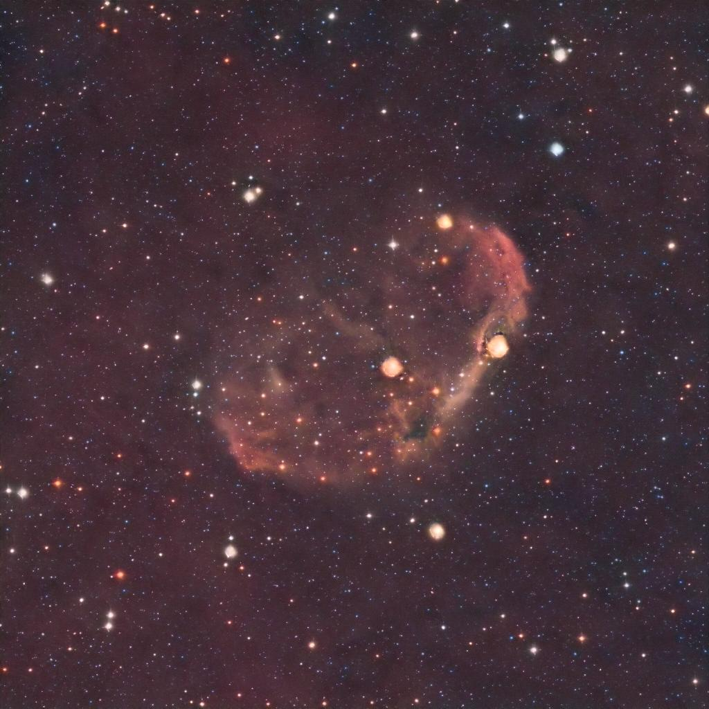
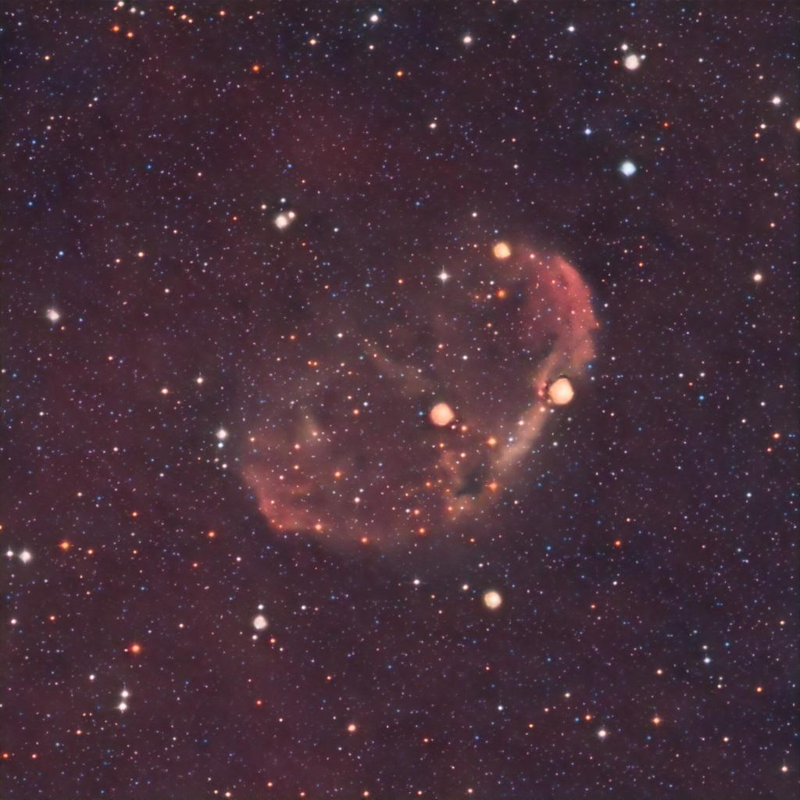
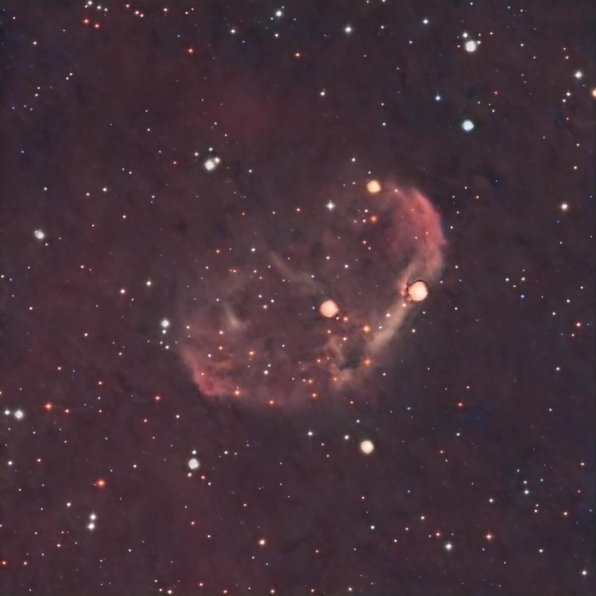
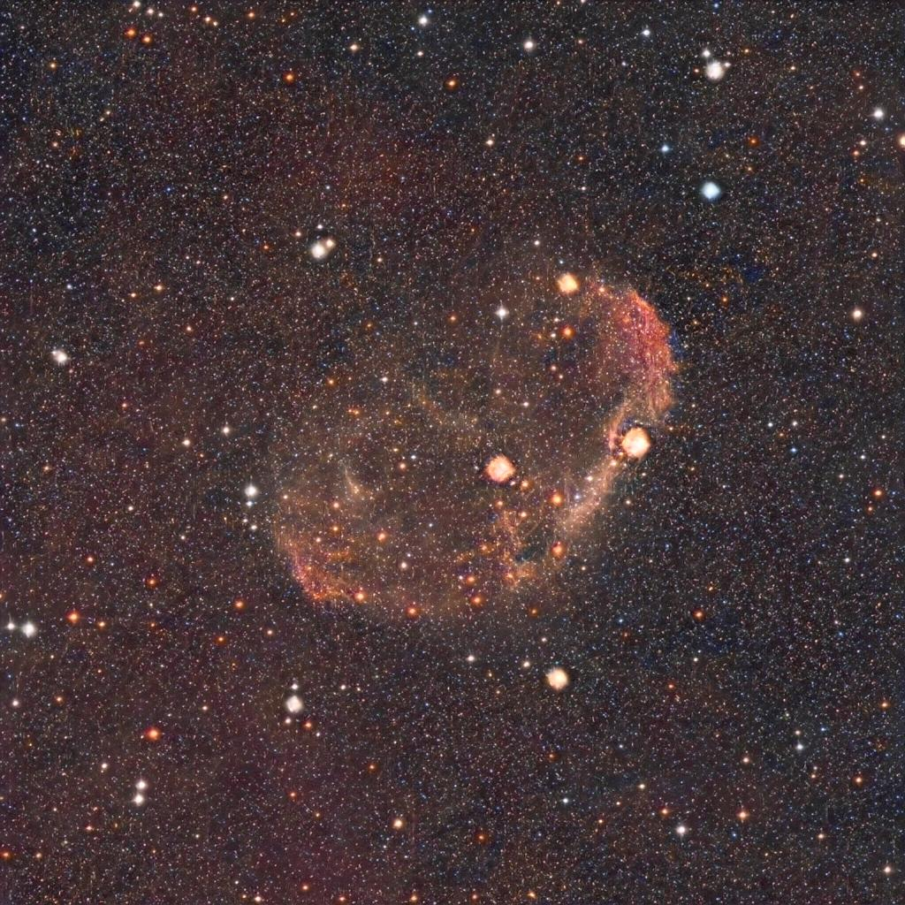
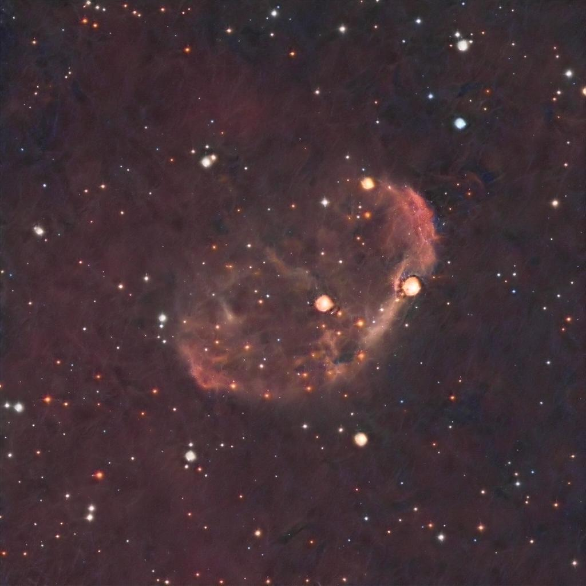

### Conditioning result on cond/raeikja9d7mc1.jpeg

[Image source](https://www.reddit.com/r/astrophotography/comments/1b5vfie/reprocessed_crescent_nebula_ngc_6888/)

TLDR: Conditioning looks successfull!

**[2023/03/04] Please note** that yes, while AstroSleuthNEXT's ability to color match leaves a lot to be desired, turns out, humams have like 100x the number of lumance cones than for color! The bandaid solution was to simply upsample the YR/CB color channels with bilinear interpolation, and it's good as gold. See [against blurx](against_blurx.md) for (simple) color matching results. Otherwise, the other models at this stage have good enough color matching that they don't need any special treatment. **Back to the original content**

It certainly failed to keep the same color, however I believe this is because the color information may be contained within the condition embedding, and because I used a generalised one for inference, the output is inaccurate.

Will be very interesting to see what other possible conditioning prompts could do? 

Ideas:
 - Saturation
 - Contrast
 - Nebula detail
 - Diffraction spikes

| Original  | AstroNEXT (no cond)  |
| --- | --- |
|  |  |

| Low detail, high stars  | Low detail, low stars  |
| --- | --- |
|  |  |

| high detail, high stars  | high detail, low stars  |
| --- | --- |
|  |  |

